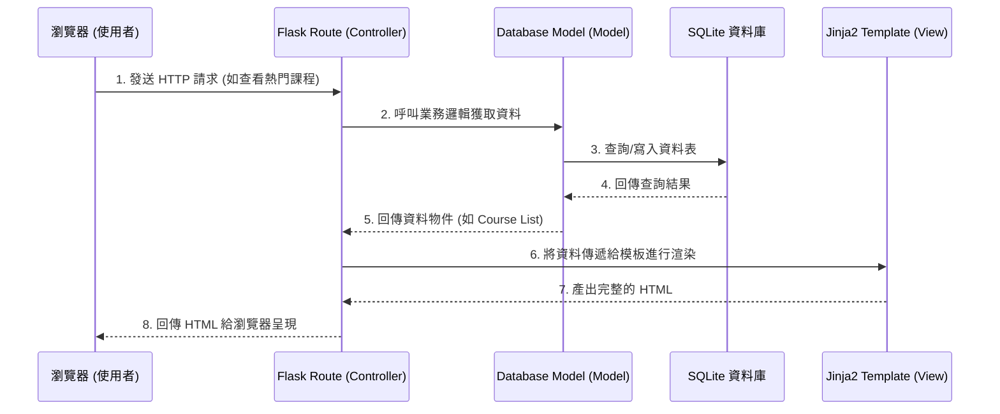

# 系統架構設計 (System Architecture)

## 1. 技術架構說明

本專案「選課交換平台」採用輕量且高效的 Web 開發堆疊，不採取前後端分離，透過伺服器端渲染 (SSR) 快速建構出可用的 MVP。

### 選用技術與原因
- **後端框架**：Python + Flask
  - **原因**：Flask 是輕量級框架，上手快、具備高彈性，適合快速開發與驗證 MVP 平台。
- **模板引擎**：Jinja2
  - **原因**：內建於 Flask，可直接在 HTML 中撰寫 Python 邏輯（如迴圈、條件判斷），適合非前後端分離的架構。
- **資料庫**：SQLite (透過 SQLAlchemy 或原生 sqlite3)
  - **原因**：無需額外架設資料庫伺服器，資料儲存於單一檔案中，開發初期與測試階段極為方便。
- **前端技術**：HTML5, CSS3 (Vanilla CSS), JavaScript (Vanilla JS)
  - **原因**：搭配 Jinja2 處理畫面呈現與部分即時互動（如匿名聊天室）。

### Flask MVC 模式說明
- **Model (資料模型)**：負責與 SQLite 互動，定義如 `User`（使用者）、`Course`（課程）、`Wishlist`（許願清單）、`Match`（媒合紀錄）等資料表結構與業務邏輯。
- **View (視圖)**：由 Jinja2 模板與 CSS/JS 組成，負責將 Model 處理好的資料渲染為使用者看得到的網頁畫面（如熱門課程看板、清單頁面）。
- **Controller (控制器)**：由 Flask Routes (`@app.route`) 擔任，接收使用者的 HTTP 請求（如新增許願課程、送出訊息），呼叫對應的 Model 處理資料，最後回傳對應的 View 呈現。

---

## 2. 專案資料夾結構

以下為建議的資料夾結構，以利於專案維護與後續擴展：

```text
web_app_development/
├── app/
│   ├── __init__.py      # Flask 應用程式工廠與初始化
│   ├── models/          # Model: 資料庫模型定義 (User, Course, Wishlist 等)
│   │   ├── __init__.py
│   │   ├── user.py
│   │   ├── course.py
│   │   └── match.py
│   ├── routes/          # Controller: 路由處理與業務邏輯
│   │   ├── __init__.py
│   │   ├── auth.py      # 登入、註冊認證相關
│   │   ├── course.py    # 課程許願與清單管理
│   │   ├── chat.py      # 即時通訊相關
│   │   └── main.py      # 首頁、熱門課程看板等通用路由
│   ├── templates/       # View: Jinja2 HTML 模板
│   │   ├── base.html    # 共用版型 (Header, Footer, Navigation)
│   │   ├── index.html   # 首頁
│   │   ├── login.html   # 登入頁
│   │   ├── wishlist.html# 許願清單頁
│   │   └── chat.html    # 聊天室頁
│   └── static/          # 靜態資源檔案
│       ├── css/         # 樣式表 (index.css)
│       ├── js/          # 前端互動邏輯
│       └── images/      # 圖片與圖示
├── instance/
│   └── database.db      # SQLite 資料庫檔案 (不進版控)
├── docs/                # 專案文件 (PRD, Architecture 等)
│   ├── PRD.md
│   └── ARCHITECTURE.md
├── .gitignore           # Git 忽略設定
├── requirements.txt     # Python 依賴套件清單
└── app.py               # 專案啟動入口
```

---

## 3. 元件關係圖

透過以下流程圖可以了解使用者、Flask Server、資料庫及模板之間的資料流向：



---

## 4. 關鍵設計決策

1. **採用藍圖 (Blueprints) 模組化路由**
   - **原因**：將不同功能的路由拆分至 `auth.py`, `course.py`, `chat.py` 等獨立檔案，避免所有程式碼集中在單一 `app.py` 中，提升可讀性與多人協作的效率。
2. **優先實作非同步長輪詢 (Long Polling) 進行簡易聊天**
   - **原因**：為了符合 MVP 快速開發原則，初期可先用 AJAX 長輪詢實作聊天室，若未來遇到效能瓶頸或人數增加，再考慮導入 WebSocket (如 Flask-SocketIO)。
3. **後台定期排程執行媒合演算法**
   - **原因**：自動媒合若在每次使用者新增清單時即時觸發，可能導致系統回應過慢。初期設計採「排程批次處理」或「背景任務 (Background Task)」的方式定期運算，以確保前端操作的順暢度。
4. **身份驗證與 Email 驗證並行**
   - **原因**：考量到直接串接校方 SSO (單一登入) 可能有權限申請的門檻。系統初期將內建 Email 網域驗證（限制 `.edu.tw` 註冊）作為基礎防線，並保留未來串接 SSO 的彈性。
