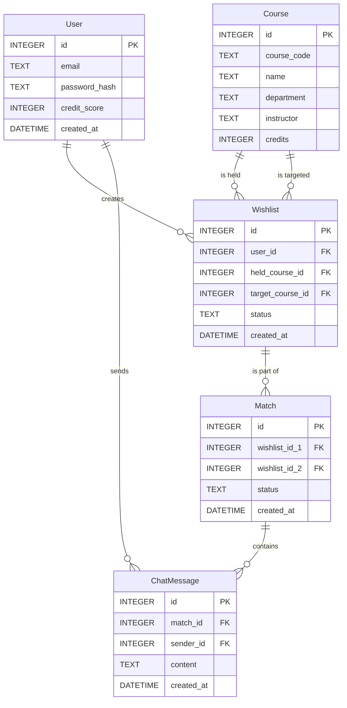

# 資料庫設計 (Database Design)

本文件描述了選課交換平台的資料庫結構，採用 SQLite 作為資料儲存庫。

## ER 圖 (實體關係圖)

## 資料表詳細說明

### 1. `users` (使用者表)
儲存平台使用者的基本資料與認證資訊。
- `id` (INTEGER): Primary Key, 自動遞增。
- `email` (TEXT): 學校信箱，唯一且必填，用於登入與通知。
- `password_hash` (TEXT): 加密後的密碼，必填。
- `credit_score` (INTEGER): 使用者信用分數，預設值例如 100，用來評估誠信。
- `created_at` (DATETIME): 帳號建立時間。

### 2. `courses` (課程表)
儲存學校的所有課程基礎資料，供學生加入清單時選用。
- `id` (INTEGER): Primary Key, 自動遞增。
- `course_code` (TEXT): 學校官方的課程代碼，唯一。
- `name` (TEXT): 課程名稱，必填。
- `department` (TEXT): 開課系所。
- `instructor` (TEXT): 授課教師名稱。
- `credits` (INTEGER): 學分數。

### 3. `wishlists` (許願清單表)
紀錄使用者想要換出的課程與想要換入的課程。
- `id` (INTEGER): Primary Key, 自動遞增。
- `user_id` (INTEGER): Foreign Key 指向 `users.id`，必填。
- `held_course_id` (INTEGER): Foreign Key 指向 `courses.id`，代表使用者擁有的課程。
- `target_course_id` (INTEGER): Foreign Key 指向 `courses.id`，代表使用者想要的課程。
- `status` (TEXT): 清單狀態 (例如: `pending`, `matched`, `completed`, `cancelled`)。
- `created_at` (DATETIME): 建立時間。

### 4. `matches` (配對紀錄表)
紀錄系統配對成功的結果，將兩筆 (或多筆) 願望清單關聯在一起。
- `id` (INTEGER): Primary Key, 自動遞增。
- `wishlist_id_1` (INTEGER): Foreign Key 指向 `wishlists.id`。
- `wishlist_id_2` (INTEGER): Foreign Key 指向 `wishlists.id`。
- `status` (TEXT): 狀態 (例如: `chatting`, `completed`, `cancelled`)。
- `created_at` (DATETIME): 配對成功建立時間。

### 5. `chat_messages` (聊天訊息表)
儲存配對雙方在匿名聊天室中的通訊內容。
- `id` (INTEGER): Primary Key, 自動遞增。
- `match_id` (INTEGER): Foreign Key 指向 `matches.id`。
- `sender_id` (INTEGER): Foreign Key 指向 `users.id`。
- `content` (TEXT): 訊息文字內容。
- `created_at` (DATETIME): 發送時間。
