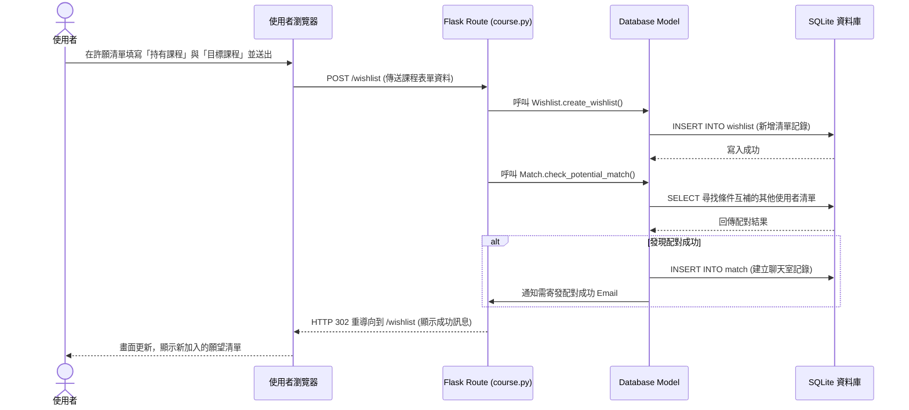

# 選課交換平台流程圖設計 (Flowcharts)

本文件描述了選課交換平台的使用者操作路徑與系統內部的資料互動流程。

## 1. 使用者流程圖（User Flow）

描述使用者從進入網站到完成課程交換的完整操作路徑。

```mermaid
flowchart LR
    A([使用者開啟網頁]) --> B{是否已登入？}
    
    B -- 否 --> C[登入/註冊頁面 (Email認證)]
    C --> D[首頁 - 熱門課程看板]
    B -- 是 --> D
    
    D --> E{選擇操作}
    
    E -->|查看課程與熱門度| F[瀏覽熱門課程排行榜]
    F --> E
    
    E -->|管理個人清單| G[我的許願清單頁面]
    G --> H[新增/編輯現有課程與目標課程]
    H --> I[系統自動/定期背景媒合]
    
    I -.->|配對成功發送通知| J((收到媒合通知))
    J --> K[進入專屬匿名聊天室]
    
    E -->|處理媒合結果| K
    
    K --> L[雙方溝通約定退加選時間]
    L --> M[實際操作選課系統完成交換]
    M --> N[給予對方誠信評價]
    N --> D
```

---

## 2. 系統序列圖（Sequence Diagram）

以下序列圖描述了「使用者新增課程許願清單，並觸發媒合檢查」的系統流程：



---

## 3. 功能清單對照表

以下為 MVP 階段的主要功能、對應的 URL 路徑與 HTTP 方法規劃：

| 功能描述 | URL 路徑 | HTTP 方法 | 負責的 Blueprint (Controller) |
| :--- | :--- | :--- | :--- |
| **首頁 / 熱門看板** | `/` | GET | `main.py` |
| **使用者註冊/登入** | `/login` | GET, POST | `auth.py` |
| **使用者登出** | `/logout` | GET | `auth.py` |
| **查看個人許願清單** | `/wishlist` | GET | `course.py` |
| **新增願望 (持有/目標)** | `/wishlist/add` | POST | `course.py` |
| **刪除願望** | `/wishlist/delete/<id>` | POST | `course.py` |
| **查看媒合成功列表** | `/matches` | GET | `chat.py` |
| **進入專屬聊天室** | `/chat/<match_id>` | GET | `chat.py` |
| **發送聊天訊息** | `/chat/<match_id>/send`| POST | `chat.py` |
| **送出使用者評價** | `/rate/<match_id>` | POST | `course.py` (或 `auth.py`) |
